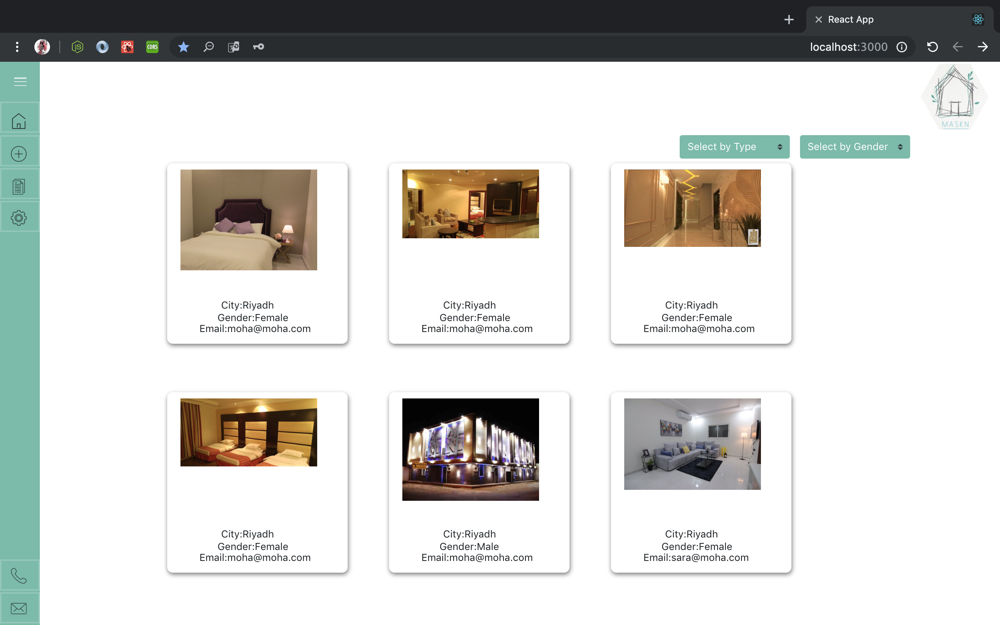

# Maskan : 

Maskn is a website provide solution and services for students (female and male ) whose looking for appropriate accommodation , according to the best standards as(security ,price, and service quality ) . on other hand the users can add building in separated page . 

## Features && steps  
- The user can add,update , and delete building . 
- The user can manage all building post on his page . 
- The user can select building depending on room category and gender . 
- The system display all buildings on single page . 

## Technologies used:  
- React .
- MySQL Postgres .  
- Java Script .  
- CSS.  
- Boostrap .  
- Node.js and Express .  

## Resours and helpful: 
1. https://getbootstrap.com/  
2. https://reactjs.org/ 
3. https://stackoverflow.com  

## App demo : 

 ## future plan :  
1. Add google map feather  
2. allow users to make comment and rate buildings service . 
3. add notification feather if the room is booked . 
4. allow user to make booking in specific date and add payment method . 

## Acknowledgements/Thanks:  
1-Mickael Finneran 
2-Mr.Usman Bashir  
3-Miss.Ghadeer  
4-All WDI3 students  
``